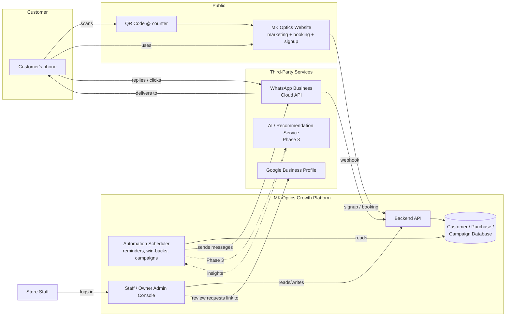

# Technical Architecture

**Project:** MK Optics Growth Platform
**Companion documents:** `01-product-requirements.md`, `03-data-model.md`, `04-api-specification.md`

---

## 1. Architecture Goals

- Small-team buildable and maintainable — MK Optics is a single-store deployment, not a high-scale system.
- WhatsApp-first customer communication — no customer-facing app to install.
- Clear separation between the **public marketing site** (already exists, to be extended), the **customer intake page**, the **staff/admin console**, and the **automation/messaging engine**.
- Cheap to run monthly (aligned with the ₹2,500–₹4,000/month plan) — favor managed/serverless services over dedicated infrastructure.

## 2. System Context Diagram

## 3. Components

### 3.1 Public Website (existing, extended)
The current static `index.html` marketing site is extended, not replaced, with:
- A booking entry point (`#eye-test`) wired to the platform's appointment API instead of a placeholder link.
- A `/join` (QR-linked) signup page: name, mobile number, consent checkbox → posts to the Customers API.

Recommendation: migrate the site to a lightweight framework (e.g. Next.js/Astro) only if/when server-rendered booking or account pages are needed; the marketing pages themselves can remain static.

### 3.2 Staff / Admin Console
A responsive web app (desktop at the counter, tablet-friendly) used by store staff and the owner:
- **Intake screen** — fast customer lookup-or-create, purchase entry, prescription entry.
- **Customer database** — search, filter, profile view/edit.
- **Enquiries / lost-sale tracker** — log + one-click follow-up actions.
- **Campaigns** — template library, slow-stock campaign builder, seasonal campaign scheduler.
- **Dashboard** — the metrics in PRD §3 and FR-15.
- **Settings** — store profile, WhatsApp template management, staff accounts, consent/opt-out list.

### 3.3 Backend API
A single REST API (see `04-api-specification.md`) fronting all business logic and the database. Stateless, so it can run on any managed container/PaaS platform (e.g. a small VM, Cloud Run, App Service, or similar — final choice driven by the developer's/vendor's existing hosting standard rather than a hard product requirement).

### 3.4 Automation Scheduler
A scheduled job runner (cron-style, or a managed scheduler like a queue + worker) responsible for:
- Evaluating "next visit due" / replenishment-due dates daily and enqueuing reminder messages.
- Running enquiry follow-up cadences (e.g. day 2, day 7 nudge if no staff action taken).
- Triggering post-purchase review/referral requests after the defined delay.
- Executing scheduled/seasonal campaigns.

This is logically separate from the API so that message volume/retries never block staff-facing requests.

### 3.5 WhatsApp Integration
- Uses the **WhatsApp Business Platform (Cloud API)** via Meta or a Business Solution Provider (BSP, e.g. Gupshup, Twilio, MessageBird, Interakt — vendor choice, not prescribed here).
- Outbound proactive messages (reminders, offers, campaigns) must use **approved message templates** (WhatsApp policy — see `05-non-functional-requirements.md`).
- Inbound replies and delivery/read receipts arrive via **webhook** into the backend and are logged against the message record.
- A **single WhatsApp Business number** for MK Optics is assumed for v1.

### 3.6 Google Business Profile Integration
- Review requests deep-link to the store's Google review URL (no API dependency required for v1 — a tracked link is sufficient).
- Google Business Profile is set up/claimed as part of Phase 1 but does not require a live API integration unless the client later wants automated review-count syncing into the dashboard.

### 3.7 AI / Recommendation Service (Phase 3, future)
A separable service (could be a hosted LLM/ML API or a simple rules+statistics engine to start) that:
- Consumes anonymized/aggregated purchase and customer data on a schedule.
- Produces per-customer "next best offer" and replenishment-date predictions.
- Writes recommendations back to the database for the Scheduler to act on.

Kept as a distinct component so it can be deferred without affecting Phases 1–2 architecture.

## 4. Suggested Technology Stack

These are recommendations to unblock delivery estimates in the roadmap/SOW — the development team may substitute equivalents that match its existing standards without changing the architecture above.

| Layer | Suggested choice | Rationale |
|---|---|---|
| Frontend (Admin console + signup page) | React or Vue SPA, or Next.js | Fast to build forms/dashboards; large hiring pool |
| Backend API | Node.js (NestJS/Express) or Python (FastAPI/Django) | Good WhatsApp/Cloud API SDK support, quick to iterate |
| Database | PostgreSQL (managed) | Relational data (customers/purchases/prescriptions) with clear referential integrity; easy reporting queries |
| Scheduler/queue | Managed cron + a lightweight job queue (e.g. BullMQ/Celery) or a cloud scheduler + function | Decouples messaging from request/response cycle |
| WhatsApp | Meta Cloud API directly, or via a BSP | BSP simplifies template approval and delivery analytics at a small added cost |
| Hosting | Single managed PaaS (e.g. Render, Railway, Azure App Service, or existing GitHub Pages host extended with a backend) | Minimize DevOps overhead consistent with a small monthly budget |
| File/image storage | Managed object storage (e.g. S3-compatible) | Store product/frame images, review screenshots, etc. |
| Analytics/reporting | Server-side aggregation queries + a charting library in the admin console | Avoid a separate BI tool for v1 |

## 5. Environments

| Environment | Purpose |
|---|---|
| Development | Feature development, seeded test data, WhatsApp test number |
| Staging | Client demo/UAT before each phase go-live, WhatsApp test number |
| Production | Live MK Optics data and the live WhatsApp Business number |

## 6. Deployment & CI/CD

- Git-based workflow (this repository), feature branches → review → merge to `main`.
- Automated build/test on push (GitHub Actions or equivalent).
- Staging deploy on merge to `main`; production deploy is a manual promotion step, given the small team and business-critical nature of customer messaging.

## 7. Key Technical Risks

See `08-risks-assumptions-glossary.md` for the full risk register. The two architecture-relevant risks to flag early:
1. **WhatsApp template approval turnaround** — Meta/BSP approval of message templates can take days; build the campaign/reminder features to work against a queue of *approved* templates rather than free-form text.
2. **No POS integration in v1** — purchase/prescription data quality depends entirely on staff manually entering it at checkout; the intake UI must be fast enough not to disrupt billing flow (see NFR-Performance).
