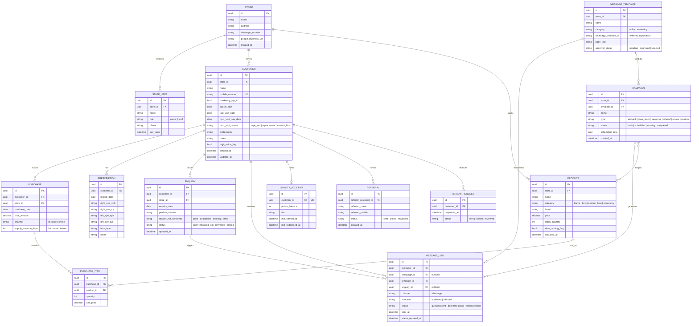

# Data Model

**Project:** MK Optics Growth Platform
**Companion documents:** `02-technical-architecture.md`, `04-api-specification.md`

---

## 1. Entity-Relationship Diagram

## 2. Entity Notes

- **CUSTOMER.marketing_opt_in / opt_in_date** — mandatory for every record; no `MESSAGE_LOG` may be created for a customer with `marketing_opt_in = false`, except transactional/utility messages tied to a purchase they initiated (see NFR — consent).
- **CUSTOMER.next_visit_due_date / next_visit_reason** — computed on purchase save (e.g. `purchase_date + 12 months` for an eye test, `purchase_date + supply_duration_days` for contact lenses). Drives the Phase 2 win-back scheduler (FR-07) and the Phase 3 replenishment prediction (FR-18).
- **CUSTOMER.high_value_flag** — a simple rule-based flag in v1 (e.g. total spend or visit count above a threshold); replaced/enhanced by the Phase 3 AI insight engine.
- **PRODUCT.slow_moving_flag** — set manually by staff/operator in v1 (FR-12); could be computed automatically later from `last_sold_at` / `stock_quantity`.
- **ENQUIRY** — captures the "Recover Lost Sales" feature (F2.2); `reason_not_converted` powers the Send Offer vs. Send Update decision in the admin console.
- **MESSAGE_TEMPLATE.whatsapp_template_id / approval_status** — every proactive/marketing message must reference a WhatsApp-approved template; the admin console must block scheduling a campaign against a non-approved template.
- **MESSAGE_LOG** — the single audit trail for all customer communication; powers the reporting dashboard (FR-15) and lets support diagnose delivery issues.
- All customer-identifying tables (`CUSTOMER`, `PRESCRIPTION`) are scoped by `store_id` so the schema can extend to multi-store without a redesign, even though v1 is single-store.

## 3. Data Retention & Sensitivity

- `PRESCRIPTION` and `CUSTOMER` contain personal data (and prescription data is health-adjacent); both require the access controls and retention policy defined in `05-non-functional-requirements.md`.
- `MESSAGE_LOG` body content should reference the template + variables rather than storing full free-text where possible, to simplify data-minimization and export requests.
