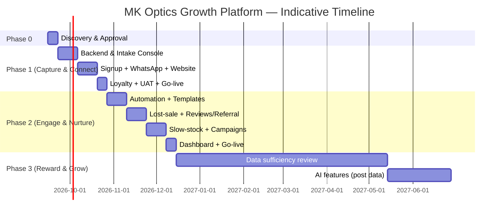

# Project Roadmap

**Project:** MK Optics Growth Platform
**Companion documents:** `01-product-requirements.md`, `07-statement-of-work.md`

Timelines are estimates for a small development team (1–2 developers + 1 designer, part-time PM) and should be re-baselined once the team is confirmed. Effort assumes the architecture in `02-technical-architecture.md`.

---

## Phase 0 — Discovery & Approval (Week 0–1)

| Deliverable | Description |
|---|---|
| Documentation package | This document set, reviewed and approved by MK Optics |
| UI design mockups | Key screens designed (Claude Design canvas — see `docs/README.md`) and approved |
| WhatsApp Business Account | MK Optics initiates WhatsApp Business Account / Meta Business verification (can run in parallel — see risk register, approval can take 1–2 weeks) |
| Content collection | Store logo, brand colors, photos, address, Google Business access handed to the dev team |

**Exit criteria:** MK Optics signs off on scope, pricing, and design direction.

## Phase 1 — Capture & Connect (Weeks 2–6)

Corresponds to PRD features F1.1–F1.6 and the "One-Time Setup" pricing tier.

| Week | Milestone |
|---|---|
| 2 | Data model + backend scaffolding; auth; store/staff setup |
| 3 | Customer intake console (create/search customer, purchase entry, prescription entry) |
| 4 | QR signup page + public signup API; WhatsApp confirmation message on signup |
| 5 | Website updates: online booking entry point wired up; Google Business Profile setup |
| 6 | Loyalty program data model + basic points display; staff training; UAT on staging |

**Exit criteria:** Staff can capture a real customer end-to-end (signup → purchase → digital record delivered on WhatsApp) in the live store. This is the go-live point for the One-Time Setup deliverables.

## Phase 2 — Engage & Nurture (Weeks 7–14)

Corresponds to PRD features F2.1–F2.7 and the start of the "Monthly Plan."

| Weeks | Milestone |
|---|---|
| 7–8 | Automation scheduler; win-back/reminder rule engine; first approved WhatsApp templates |
| 9 | Lost-sale recovery: enquiry logging + Follow Up / Send Offer / Send Update actions |
| 10 | Review & referral automation |
| 11–12 | Slow-moving stock campaign builder + customer matching (manual/rule-based in v1) |
| 13 | Campaign template library, seasonal campaign scheduling, WhatsApp catalog sharing |
| 14 | Reporting dashboard; UAT; go-live on Monthly Plan |

**Exit criteria:** All Phase 2 features live and staff trained; monthly reporting cycle established with the store owner.

## Phase 3 — Reward & Grow / AI Features (Month 6 onward, data-dependent)

Corresponds to PRD features F3.1–F3.4. **Not started until 6–12 months of live customer/purchase data has accumulated**, per the proposal deck's own "Future Feature" framing — this is a data threshold, not purely a calendar date.

| Milestone | Description |
|---|---|
| Data sufficiency review | Confirm enough purchase history exists per customer segment to train reliable recommendations |
| AI next-best-offer | Build and validate the recommendation logic (F3.1) against historical data before enabling live messages |
| Contact lens replenishment prediction | Build and validate (F3.2) |
| Loyalty redemption | In-store/digital redemption flow (F3.3) |
| Advanced insights | Segmentation dashboard for manual campaign planning (F3.4) |

**Exit criteria:** Recommendations demonstrate acceptable accuracy in a shadow/test period before being sent to live customers.

## Ongoing — Support & Iteration

Per the Monthly Plan (see `07-statement-of-work.md`): campaign execution, performance reporting, template maintenance, WhatsApp account health monitoring, and minor feature iteration based on store feedback.

## Timeline Summary

